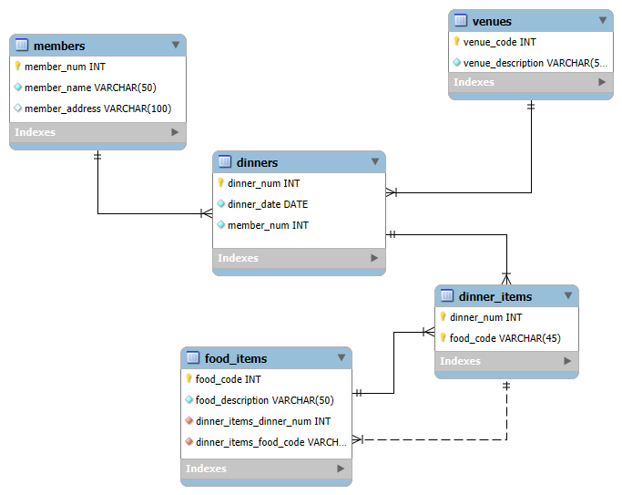

# 🍽️ Normalização de Dados – Data Warehouse do Jockey Club


Projeto prático da disciplina **Arquitetura de Dados**, onde aplicamos conceitos de normalização (**1FN, 2FN, 3FN**) em uma tabela de um **Data Warehouse** de um restaurante, utilizando **MySQL Workbench** para modelagem entidade-relacionamento.

---

## 📖 Sobre o Projeto

A atividade consiste em pegar uma tabela desnormalizada (`dinner_service`) de um Data Warehouse que armazena informações sobre jantares de membros de um Jockey Club e normalizá-la até a Terceira Forma Normal (3FN). A tabela original já está na 1FN (explicaremos o porquê).  

O objetivo é:
- Criar o modelo conceitual/lógico no MySQL Workbench.
- Dividir a tabela em entidades menores (membros, jantares, pratos, locais, etc.).
- Estabelecer os relacionamentos corretos.
- Compreender na prática a importância da normalização para evitar redundâncias e anomalias.

## 📋 Tabela Original – `dinner_service`

Amostra dos dados fornecida:

| MEMBER_NUM | MEMBER_NAME | MEMBER_ADDRESS | DINNER_NUM | DINNER_DATE | VENUE_CODE | VENUE_DESC        | FOOD_CODE | FOOD_DESC        |
|------------|-------------|----------------|------------|------------|------------|-----------------|-----------|----------------|
| 214        | Peter Wong  | 325 Meadow Park | D0001      | 15-Mar-10  | B01        | Grand Ball Room  | EN3       | Stuffed crab    |
| 214        | Peter Wong  | 325 Meadow Park | D0001      | 15-Mar-10  | B01        | Grand Ball Room  | DE8       | Chocolate mousse|
| 235        | Mary Lee    | 123 Rose Court  | D0002      | 15-Mar-10  | B02        | Petit Ball Room  | EN5       | Marinated steak |
| 235        | Mary Lee    | 123 Rose Court  | D0002      | 15-Mar-10  | B02        | Petit Ball Room  | DE8       | Chocolate mousse|
| 250        | Peter Wong  | 9 Nine Ave      | D0003      | 20-Mar-10  | C01        | Café             | SO1       | Pumpkin soup    |
| 250        | Peter Wong  | 9 Nine Ave      | D0003      | 20-Mar-10  | C01        | Café             | EN5       | Marinated steak |
| 250        | Peter Wong  | 9 Nine Ave      | D0003      | 20-Mar-10  | C01        | Café             | DE2       | Apple pie       |
| 235        | Mary Lee    | 123 Rose Court  | D0003      | 20-Mar-10  | C01        | Café             | SO1       | Pumpkin soup    |
| 235        | Mary Lee    | 123 Rose Court  | D0003      | 20-Mar-10  | C01        | Café             | EN5       | Marinated steak |
| 300        | Paul Lee    | 123 Rose Court  | D0004      | 20-Mar-10  | E10        | Petit Ball Room  | DE2       | Apple pie       |

---

### 🔍 Por que a tabela já está na 1FN?

A Primeira Forma Normal (1FN) exige que:

- Todos os atributos sejam atômicos (não divisíveis).  
- Não existam grupos repetitivos (cada coluna contém um único valor por linha).  

Na tabela `dinner_service`, cada coluna já contém valores indivisíveis (ex.: `MEMBER_NUM` é um número, `FOOD_DESC` é uma descrição única). Além disso, cada linha representa uma combinação única de membro, jantar e prato. Portanto, a tabela está em 1FN.

---

### 🧱 Processo de Normalização

#### 1. Identificação de Dependências

Dependências funcionais observadas:

- `MEMBER_NUM → MEMBER_NAME, MEMBER_ADDRESS`  
- `DINNER_NUM → DINNER_DATE, VENUE_CODE, VENUE_DESC`  
- `VENUE_CODE → VENUE_DESC`  
- `FOOD_CODE → FOOD_DESC`  

Chave primária composta: `(DINNER_NUM, FOOD_CODE)`.

---

#### 2. Segunda Forma Normal (2FN)

A 2FN exige que todos os atributos não-chave dependam da chave primária completa. Como a chave da tabela original é `(DINNER_NUM, FOOD_CODE)`, alguns atributos dependem apenas de parte da chave:

- `MEMBER_NUM, MEMBER_NAME, MEMBER_ADDRESS` dependem apenas de `DINNER_NUM`.  
- `DINNER_DATE, VENUE_CODE, VENUE_DESC` também dependem apenas de `DINNER_NUM`.  

**Correção: criação de novas tabelas:**

**Tabela `member`**  
- `member_num` (PK)  
- `member_name`  
- `member_address`  

**Tabela `dinner`**  
- `dinner_num` (PK)  
- `dinner_date`  
- `member_num` (FK → `member`)  
- `venue_code` (FK → `venue`)  

**Tabela `venue`**  
- `venue_code` (PK)  
- `venue_desc`  

**Tabela `food`**  
- `food_code` (PK)  
- `food_desc`  

**Tabela associativa `dinner_food`**  
- `dinner_num` (FK → `dinner`)  
- `food_code` (FK → `food`)  
- Chave primária composta: `(dinner_num, food_code)`  

Agora cada atributo não-chave depende totalmente da chave primária da sua respectiva tabela. A tabela `dinner_food` representa os pratos servidos em cada jantar (relacionamento N:N entre `dinner` e `food`).

---

#### 3. Terceira Forma Normal (3FN)

A 3FN exige que não haja dependências transitivas.  

- Em `dinner`, `venue_desc` depende de `venue_code`. Já está separado na tabela `venue`.  
- `member_address` depende diretamente de `member_num`.  

Portanto, a modelagem 2FN já está em 3FN.

---

### 🖼️ Modelo Entidade-Relacionamento (DER)

- `member (1) —— (N) dinner`  
  Um membro pode participar de vários jantares; cada jantar pertence a um único membro.

- `venue (1) —— (N) dinner`  
  Um local pode receber vários jantares; cada jantar ocorre em um único local.

- `dinner (N) —— (N) food` através de `dinner_food`  
  Um jantar pode servir vários pratos; um prato pode ser servido em vários jantares.

- `dinner_food` é a tabela associativa, com chave composta e FKs para `dinner` e `food`.

---

## 📸 Captura de Tela



> *Este é o Diagrama Entidade-Relacionamento (DER) que ilustra a estrutura normalizada do banco de dados após aplicar as formas normais. Ele apresenta as entidades, seus atributos e os relacionamentos entre elas.*

---

## 🗂️ Estrutura de Tabelas SQL

```sql
-- Tabela member
CREATE TABLE member (
    member_num INT PRIMARY KEY,
    member_name VARCHAR(50),
    member_address VARCHAR(100)
);

-- Tabela venue
CREATE TABLE venue (
    venue_code VARCHAR(5) PRIMARY KEY,
    venue_desc VARCHAR(50)
);

-- Tabela food
CREATE TABLE food (
    food_code VARCHAR(5) PRIMARY KEY,
    food_desc VARCHAR(50)
);

-- Tabela dinner
CREATE TABLE dinner (
    dinner_num VARCHAR(5) PRIMARY KEY,
    dinner_date DATE,
    member_num INT,
    venue_code VARCHAR(5),
    FOREIGN KEY (member_num) REFERENCES member(member_num),
    FOREIGN KEY (venue_code) REFERENCES venue(venue_code)
);

-- Tabela associativa dinner_food
CREATE TABLE dinner_food (
    dinner_num VARCHAR(5),
    food_code VARCHAR(5),
    PRIMARY KEY (dinner_num, food_code),
    FOREIGN KEY (dinner_num) REFERENCES dinner(dinner_num),
    FOREIGN KEY (food_code) REFERENCES food(food_code)
);
```

## ✅ Vantagens da Normalização

- **Eliminação de redundâncias** – Dados de membros, locais e alimentos são armazenados uma única vez.  
- **Integridade referencial** – As chaves estrangeiras garantem que não haja referências inválidas.  
- **Facilidade de manutenção** – Alterar o endereço de um membro ou a descrição de um prato é feito em um único lugar.  
- **Consulta flexível** – Podemos facilmente obter, por exemplo, todos os jantares de um membro ou todos os pratos servidos em uma data.  
- **Preparação para Data Warehouse** – Modelos normalizados são a base para construir Data Marts e cubos OLAP.  

---

## 📸 Resultados da Aula Prática

- O diagrama `.mwb` está incluso neste repositório.  
- As tabelas foram criadas conforme descrito.  
- Relacionamentos configurados com as devidas chaves.  
- Prints do diagrama e telas de edição podem ser incluídos no README real.  

---

## 🧠 Conclusão

Esta prática demonstrou o processo de normalização de dados, partindo de uma tabela plana até um modelo na **3FN**. Compreender as formas normais é essencial para qualquer profissional de dados, garantindo qualidade, consistência e facilidade de manutenção.  

A ferramenta **MySQL Workbench** mostrou-se eficiente para modelagem visual e geração de código SQL, permitindo rápida prototipação do esquema.

📝 Licença <br>
Este projeto está sob a licença MIT. Veja o arquivo LICENSE para mais detalhes.

✉️ Contato <br>
Weslley B. de Andrade – [Weslley B. de Andrade](www.linkedin.com/in/weslley-bitencourt) – [email](weslleybitencourt03@gmail.com)
Link do projeto: [biblioteca_python_v2](https://github.com/OBenzeno/Portfolio/tree/main/biblioteca_python_v2)

⭐ Se este conteúdo foi útil, deixe uma estrela no repositório!

🧩 Parte de uma série
Confira também outros projetos da faculdade:
- [Sistema de Gerenciamento de Biblioteca](https://github.com/OBenzeno/Portfolio/tree/main/biblioteca_python_v2)
- [Banco de Dados em Nuvem](https://github.com/OBenzeno/Portfolio/tree/main/Pr%C3%A1tica%20em%20SQL/Projetos%20da%20Faculdade/Banco%20de%20Dados%20em%20Nuvem)
- Mais projetos em breve...
