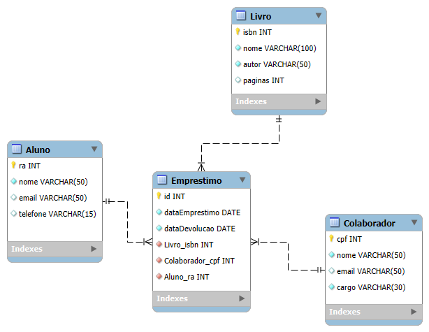

# Modelagem de Dados – Sistema de Biblioteca Universitária


Projeto prático da disciplina Modelagem de Dados, onde desenvolvemos um Diagrama Entidade-Relacionamento (DER) para um sistema de gerenciamento de biblioteca universitária, utilizando o MySQL Workbench.

## Sobre o Projeto

Uma biblioteca universitária necessita de um banco de dados para controlar empréstimos de livros para alunos. O sistema deve registrar:

- Alunos autorizados a realizar empréstimos.
- Livros disponíveis no acervo.
- Colaboradores (funcionários) que registram os empréstimos.
- Empréstimos propriamente ditos, associando aluno, livro, colaborador e datas.

O objetivo desta atividade é construir um Diagrama Entidade-Relacionamento (DER) que represente essa realidade, definindo entidades, atributos, chaves primárias e estrangeiras, além dos tipos de dados adequados. O modelo servirá como base para a implementação física do banco de dados.

## Entidades e Atributos

A partir da descrição, identificamos quatro entidades principais. Abaixo estão listados seus atributos com sugestões de tipos de dados compatíveis com MySQL.

### Livro

| Atributo  | Tipo de Dado | Descrição                                 |
|-----------|--------------|-------------------------------------------|
| isbn      | INT          | Código ISBN do livro (chave primária)     |
| nome      | VARCHAR(100) | Título do livro                          |
| autor     | VARCHAR(50)  | Nome do autor                            |
| paginas   | INT          | Número de páginas                        |

### Aluno

| Atributo  | Tipo de Dado | Descrição                                 |
|-----------|--------------|-------------------------------------------|
| ra        | INT          | Registro acadêmico do aluno (chave primária) |
| nome      | VARCHAR(50)  | Nome completo                            |
| email     | VARCHAR(50)  | E-mail de contato                        |
| telefone  | VARCHAR(15)  | Telefone para contato                    |

### Colaborador

| Atributo  | Tipo de Dado | Descrição                                 |
|-----------|--------------|-------------------------------------------|
| cpf       | INT          | CPF do colaborador (chave primária)       |
| nome      | VARCHAR(50)  | Nome completo                            |
| email     | VARCHAR(50)  | E-mail institucional                     |
| cargo     | VARCHAR(30)  | Cargo na biblioteca                      |

### Empréstimo

| Atributo         | Tipo de Dado | Descrição                                 |
|------------------|--------------|-------------------------------------------|
| id               | INT          | Identificador único do empréstimo (chave primária) |
| dataEmprestimo   | DATE         | Data em que o empréstimo foi realizado    |
| dataDevolucao    | DATE         | Data prevista para devolução             |
| Livro_isbn       | INT          | Chave estrangeira referenciando Livro(isbn) |
| Colaborador_cpf  | INT          | Chave estrangeira referenciando Colaborador(cpf) |
| Aluno_ra         | INT          | Chave estrangeira referenciando Aluno(ra) |

> **Observação:** A escolha de INT para ISBN e CPF é uma simplificação; em projetos reais, esses campos podem ser VARCHAR para acomodar zeros à esquerda e caracteres especiais. Neste contexto acadêmico, a simplificação é aceitável.

## Relacionamentos

- **Aluno e Empréstimo:** Um Aluno pode realizar vários Empréstimos (relacionamento 1:N entre Aluno e Empréstimo).
- **Livro e Empréstimo:** Um Livro pode estar envolvido em vários Empréstimos (relacionamento 1:N entre Livro e Empréstimo). Isso implica que o mesmo livro pode ser emprestado múltiplas vezes, mas cada empréstimo refere-se a um único livro.
- **Colaborador e Empréstimo:** Um Colaborador pode registrar vários Empréstimos (relacionamento 1:N entre Colaborador e Empréstimo).
- O modelo não prevê um relacionamento direto entre Aluno e Livro; ele é mediado pela entidade **Empréstimo**, que também registra o colaborador responsável.

## Diagrama Entidade-Relacionamento (DER)

Abaixo está o DER desenvolvido no MySQL Workbench, representando as entidades e seus relacionamentos.



*Figura 1: Modelo entidade-relacionamento para o sistema de biblioteca.*

## Criação das Tabelas (SQL)

A partir do modelo, podemos gerar o script SQL para criação das tabelas no MySQL:

```sql
CREATE TABLE Livro (
    isbn INT PRIMARY KEY,
    nome VARCHAR(100) NOT NULL,
    autor VARCHAR(50) NOT NULL,
    paginas INT
);

CREATE TABLE Aluno (
    ra INT PRIMARY KEY,
    nome VARCHAR(50) NOT NULL,
    email VARCHAR(50),
    telefone VARCHAR(15)
);

CREATE TABLE Colaborador (
    cpf INT PRIMARY KEY,
    nome VARCHAR(50) NOT NULL,
    email VARCHAR(50),
    cargo VARCHAR(30)
);

CREATE TABLE Emprestimo (
    id INT PRIMARY KEY,
    dataEmprestimo DATE NOT NULL,
    dataDevolucao DATE,
    Livro_isbn INT NOT NULL,
    Colaborador_cpf INT NOT NULL,
    Aluno_ra INT NOT NULL,
    FOREIGN KEY (Livro_isbn) REFERENCES Livro(isbn),
    FOREIGN KEY (Colaborador_cpf) REFERENCES Colaborador(cpf),
    FOREIGN KEY (Aluno_ra) REFERENCES Aluno(ra)
);
```

## Importância da Modelagem de Dados

A construção de um DER é o primeiro passo para garantir:

- **Integridade dos dados:** por meio de chaves primárias e estrangeiras.
- **Eficiência nas consultas:** relacionamentos bem definidos facilitam a recuperação de informações.
- **Manutenibilidade:** um modelo claro permite alterações futuras sem comprometer a estrutura.
- **Comunicação entre equipes:** o diagrama serve como documentação visual do negócio.

## Resultados da Aula Prática

- O diagrama foi criado no MySQL Workbench e exportado no formato `.mwb` e como imagem `.png`.
- As entidades, atributos e relacionamentos foram definidos conforme a proposta.
- O modelo atende aos requisitos funcionais da biblioteca.

