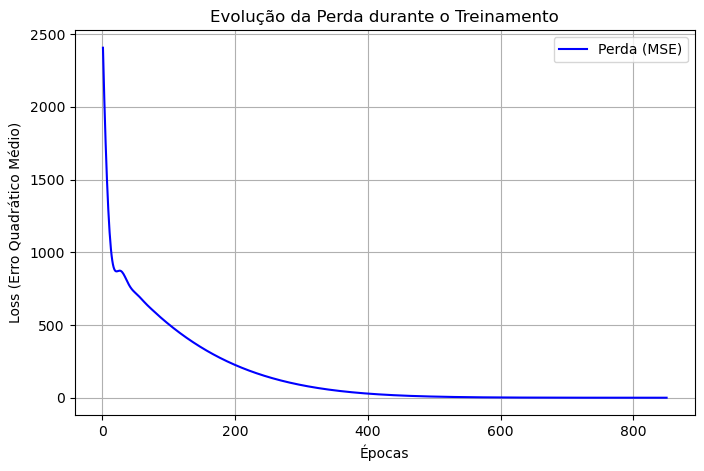

# 🌡️ Conversão Celsius → Fahrenheit com Redes Neurais

[](https://tensorflow.org)
[](https://python.org)
[](LICENSE)

Este projeto foi desenvolvido como atividade prática para a disciplina **Redes Neurais e Deep Learning**. O objetivo é criar um modelo preditivo usando **TensorFlow** e **Keras** que aprenda a converter temperaturas de Celsius para Fahrenheit a partir de exemplos, sem conhecer a fórmula matemática previamente.

## 📌 Índice

- [Sobre o Projeto](#sobre-o-projeto)
- [Tecnologias Utilizadas](#tecnologias-utilizadas)
- [Dados de Treinamento](#dados-de-treinamento)
- [Arquitetura do Modelo](#arquitetura-do-modelo)
- [Treinamento](#treinamento)
- [Resultados](#resultados)
- [Como Executar](#como-executar)
- [Estrutura do Notebook](#estrutura-do-notebook)
- [Licença](#licença)

## 🧠 Sobre o Projeto

No modelo tradicional de programação, converter Celsius para Fahrenheit é trivial: `F = C * 1.8 + 32`. Porém, este exercício simula um cenário de **Machine Learning supervisionado**:

- Não sabemos a fórmula de antemão.
- Fornecemos apenas pares de exemplo (Celsius, Fahrenheit).
- A rede neural **descobre** a relação através de ajustes sucessivos de pesos e vieses.

Isso demonstra como modelos de deep learning podem aprender mapeamentos complexos quando a relação matemática é desconhecida.

## 🛠️ Tecnologias Utilizadas

- **Python 3.13**
- **TensorFlow 2.21.0** – construção e treinamento da rede neural
- **NumPy** – manipulação dos dados numéricos
- **Matplotlib** – visualização da curva de perda (loss)
- **Pandas** – exibição da tabela comparativa

## 📊 Dados de Treinamento

Foram utilizados os seguintes 7 pares de temperatura (Celsius → Fahrenheit):

| Celsius (°C) | Fahrenheit (°F) |
|--------------|----------------|
| -40          | -40             |
| -10          | 14              |
| 0            | 32              |
| 8            | 46.4            |
| 15           | 59              |
| 22           | 71.6            |
| 38           | 100             |

Estes dados são suficientes para o modelo aprender a relação linear, pois a rede possui apenas 2 parâmetros ajustáveis (peso e viés).

## 🏗️ Arquitetura do Modelo

O modelo utilizado é **extremamente simples**, composto por uma única camada densa:

```python
modelo = tf.keras.Sequential([
    tf.keras.layers.Input(shape=[1]),  # entrada: valor em Celsius
    tf.keras.layers.Dense(units=1)     # saída: valor em Fahrenheit
])
```

## 🧠 Arquitetura do Modelo

- **Camada de entrada:** 1 neurônio (recebe um número real)  
- **Camada de saída:** 1 neurônio sem ativação (regressão linear)  

**Equivalência matemática:**  
\[
F = w \cdot C + b
\]

Testamos também arquiteturas com camadas ocultas e ativação ReLU, mas a convergência foi prejudicada devido à pequena escala dos dados e ao número reduzido de exemplos. A escolha final recaiu sobre o modelo mais simples e matematicamente adequado para uma relação linear.

---

## ⚙️ Treinamento

- **Otimizador:** Adam com `learning_rate = 0.1` (taxa maior que o padrão para acelerar a convergência)  
- **Função de perda:** mean_squared_error (erro quadrático médio)  
- **Número de épocas:** 850  
- **Dados de treino:** 7 pares (Celsius, Fahrenheit)  

---

## 📉 Evolução da Perda

O gráfico abaixo mostra a rápida queda do *loss* (MSE) nas primeiras épocas e a estabilização próxima de zero:


*(imagem gerada automaticamente pelo notebook)*

Observou-se que, a partir de aproximadamente **650 épocas**, o *loss* já se encontrava abaixo de **1,0**, e com **850 épocas** atingiu o valor final de **0,032**, demonstrando convergência adequada.

---

## 📈 Resultados

### 🔢 Métricas Finais

| Métrica                     | Valor     |
|----------------------------|----------|
| Loss final (MSE)           | 0,031918 |
| Erro médio absoluto (MAE)  | 0,2350 °F |

---

### 🧪 Teste com 10 novos valores

O modelo foi testado com temperaturas não vistas durante o treinamento:

| Celsius (°C) | Previsto (°F) | Real (°F) | Diferença |
|-------------|--------------|----------|-----------|
| -30         | -22,11       | -22,0    | -0,11     |
| -5          | 22,83        | 23,0     | -0,17     |
| 5           | 40,81        | 41,0     | -0,19     |
| 12          | 53,39        | 53,6     | -0,21     |
| 20          | 67,77        | 68,0     | -0,23     |
| 25          | 76,76        | 77,0     | -0,24     |
| 30          | 85,75        | 86,0     | -0,25     |
| 35          | 94,74        | 95,0     | -0,26     |
| 40          | 103,73       | 104,0    | -0,27     |
| 100         | 211,58       | 212,0    | -0,42     |

As diferenças são pequenas (**erro médio absoluto de 0,235 °F**), confirmando que o modelo generaliza corretamente.

## 🚀 Como Executar

### ▶️ Opção 1 – Executar localmente (Jupyter ou VSCode)

#### 1. Clone este repositório
```
git clone https://github.com/seu-usuario/celsius-fahrenheit-neural-network.git  
cd celsius-fahrenheit-neural-network  
```
#### 2. Crie um ambiente virtual (opcional, mas recomendado)
```
python -m venv venv  
source venv/bin/activate   # Linux/macOS  
venv\Scripts\activate      # Windows  
```
#### 3. Instale as dependências
```
pip install tensorflow numpy matplotlib pandas  
```
#### 4. Execute o Jupyter Notebook
```
jupyter notebook rn_celcius_fahrenheit.ipynb
```

### ▶️ Opção 2 – Executar no Google Colab

[](https://colab.research.google.com/)

Clique no link acima ou faça upload do arquivo `.ipynb` para o Colab. Não é necessária instalação local.

---

## 📁 Estrutura do Notebook

O notebook está organizado nas seguintes seções:

- Importação de Bibliotecas – TensorFlow, NumPy, Matplotlib, Pandas  
- Dados de Treinamento – definição dos 7 pares Celsius-Fahrenheit  
- Construção do Modelo – arquitetura de camada única, compilação  
- Treinamento – 850 épocas, armazenamento do histórico  
- Gráfico de Perda – visualização da convergência  
- Teste com Novos Valores – previsão para 10 temperaturas não vistas  
- Tabela Comparativa – comparação entre previsto e real  
- Explicações Teóricas – justificativa da arquitetura, conceitos de aprendizado supervisionado  
- Checklist – verificação dos requisitos da atividade  

---

## 📄 Licença

Este projeto está sob a licença MIT. Consulte o arquivo `LICENSE` para mais informações.

---

Desenvolvido como atividade acadêmica para a disciplina Redes Neurais e Deep Learning.  
Autor: Weslley Bitencourt
